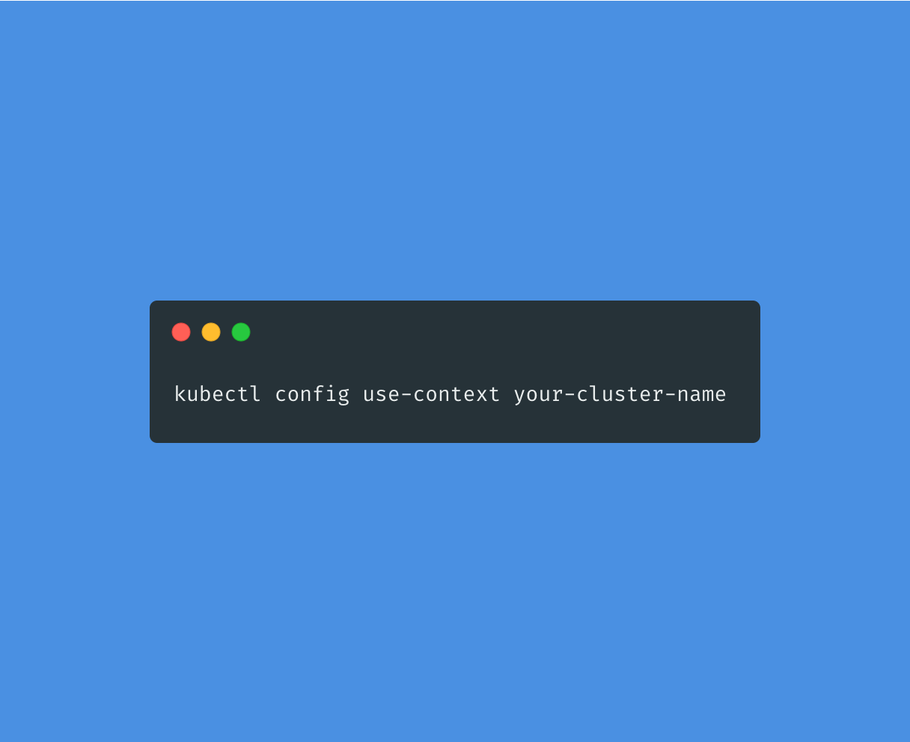

Quick post to list kubectl commands to view and change contexts, as I had to search around quite a bit. 

## Get current contexts

```bash
kubectl config current-context 
```

## To list all available contexts

```bash
kubectl config get-contexts
# display list of contexts 
```

## Set a context

```bash
kubectl config use-context your-cluster-name
# set the default context to your-cluster-name
```

## Bash function to switch contexts if you do it often

```bash
function change-context()
{
  if [ "$1" = "dev" ]; then
  kubectl config use-context your-dev-cluster-name
  elif [ "$1" = "stage" ]; then
  kubectl config use-context your-staging-cluster-name
  elif [ "$1" = "prod" ]; then
  kubectl config use-context your-prod-cluster-name
  fi
}
```
For more Kubectl context and configuration options, [click here](https://kubernetes.io/docs/reference/kubectl/cheatsheet/#kubectl-context-and-configuration).
