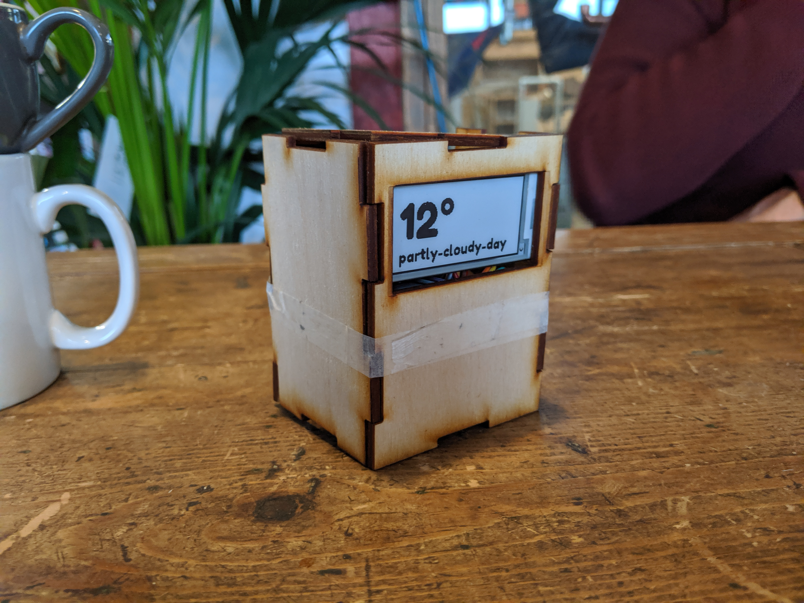
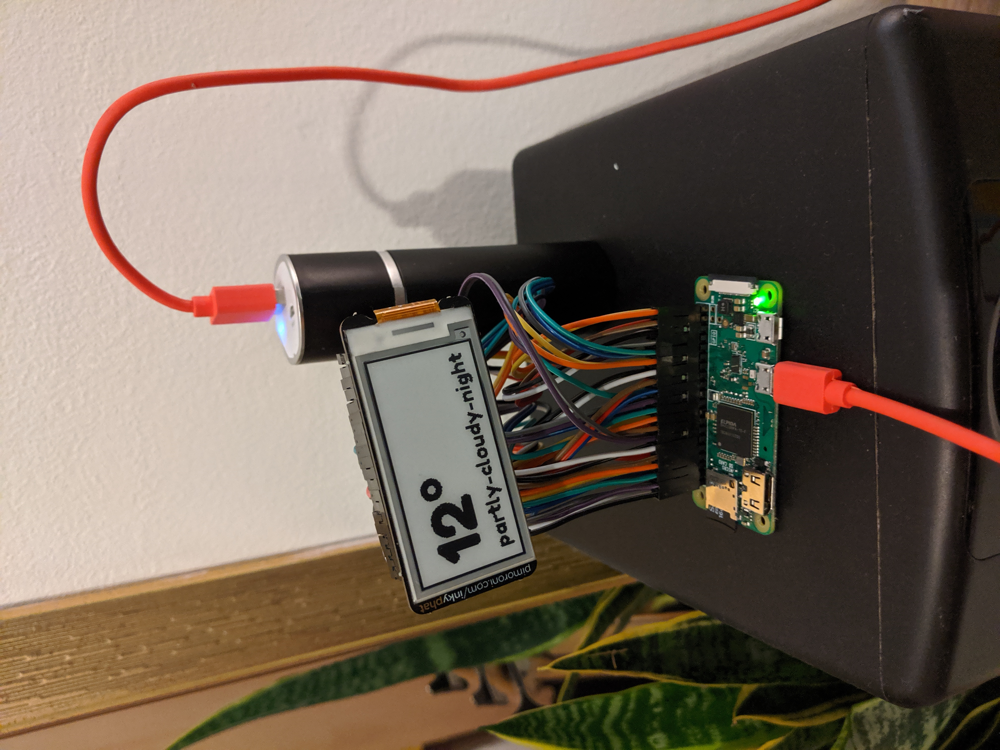
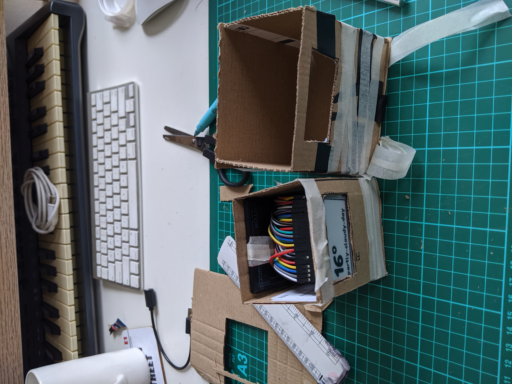
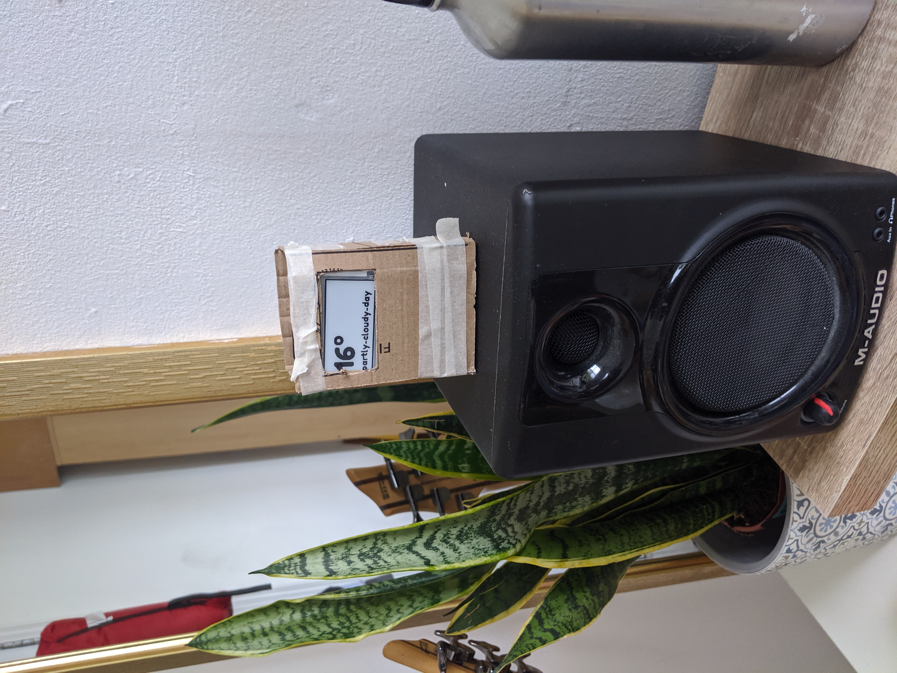
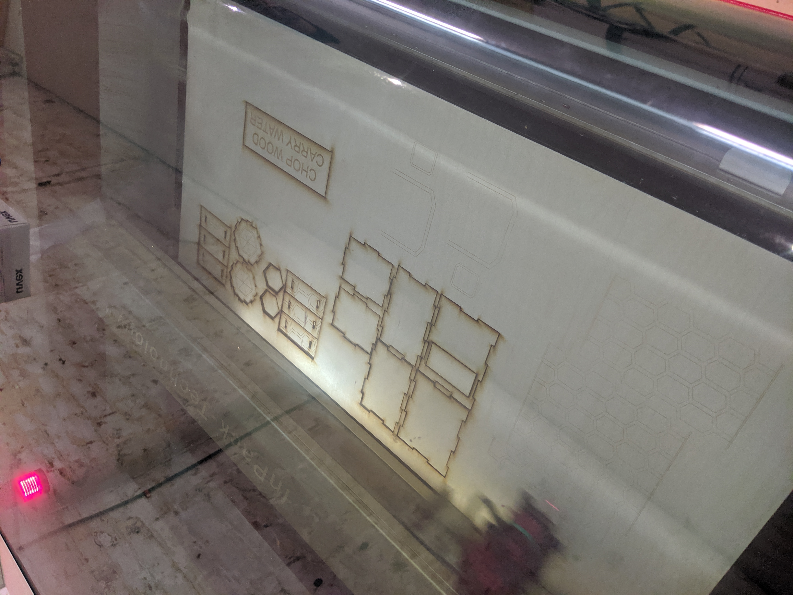
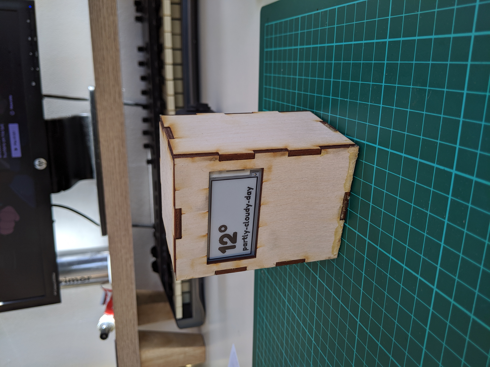

I built a thing that displays the current weather (it updates every 10 minutes). It's a raspberry pi connected to an e-ink display, and a python script that runs every 10 minutes, which also updates the screen.  [here](www.google.com)

## Here's a GIF of it in action

The pi is connected to the inkyphat display via a 40x 20cm Male-Female Jumper Wire Cable ([found for less than £3](https://www.amazon.co.uk/Conductor-Female-Jumper-Color-Ribbon/dp/B00ATMHU52/ref=alp_dpwidget_a_w_?th=1&psc=1&smid=A258M9JSP6L6E7)). I didn't know how to solder (at the time of writing this), so I ended up using the [GPIO Hammer Header](https://shop.pimoroni.com/products/gpio-hammer-header). Here's a [video](https://www.youtube.com/watch?v=ddLbUNlaZ3U) on how to use the hammer header. 

## Prototyping a case

I wanted a case to house the thing as I don't like naked wires (especially for a thing that you may have to look at every day). I considered 3D printing, but then realised I didn't have enough time to learn the ropes of yet another thing. As cool as I think it would be, I really like making progress on projects, especially since I'm working on this mostly during the weekends.

Initially, I was going for a case that could house a battery. I went with using a cheap credit-card shaped phone charger. This is embarrassing to admit, because it would have taken me all of 30 minutes to get my head around how much power a pi zero w would need to know a credit-card shaped one would not keep the pi alive for more than a few hours.

**Here's what I ended up with:**

## Laser cutting the case

I had access to a laser cutter at a local woodworking space so I decided to laser cut the case for this project. 

I found [makercase.com](https://en.makercase.com/#/basicbox) that will give you a ready to cut file that you can use (note that you need to know the thickness of the material you want to cut). I chose to use laserply (plywood that you can safely laser cut) because it was relatively cheap and forgiving when you make mistakes. 

**Here's the laser cutter in action**

## The unfinished piece

I'm not entirely done with this yet - this is still a work in progress. I'll update this post when I do make more changes, but I wanted to start documenting what I've done on it so far.

If you have any questions, I'm at [@nkhil](http://twitter.com/nkhil).
