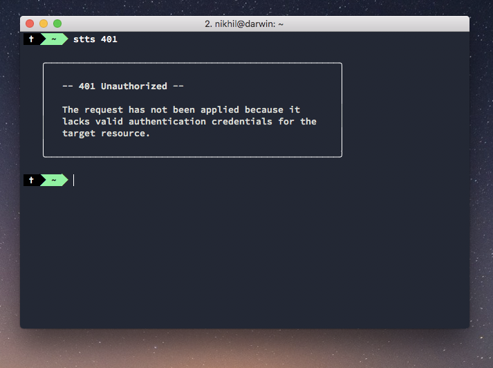

I built a tool that lets me look up definitions for HTTP status codes offline and straight from within the command line.

I want to give full credit to [https://httpstatuses.com/](https://httpstatuses.com/) for a thoroughly useful resource made available without ads. 

## Setup

Install the npm module globally

```bash
npm install -g stts
```

You should now be able to use it by typing `stts` followed by any HTTP code you want a quick definition for. Example: 

```bash
stts 301
```

## Making my first npm module

I love making little tools that make life easier - so I made this simple offline reference tool. I actually tend to use it more than I expected which is surprisingly great. Also, I got to do some rudimentary web scraping.

## The business logic is pretty straightforward

First of all, here is a link to the Github project: [https://github.com/nkhil/stts](https://github.com/nkhil/stts).

All my code is inside the src folder. The actual logic is super basic - I have an object (look for _data.json_ if you're looking at the github repo) with status codes and their descriptions as key-value pairs. I also have an array of all the HTTP status codes. Then it's just a matter of looping over the status codes array, and if that status code exists as a key, then I log out the description in the console. 

For styling / formatting, I'm using a couple of external dependencies like chalk and word-wrap. 

## Getting it to work from within the command line

Once I'd published the module, getting it to work from within the terminal was slightly tricky, but thanks to [this article](https://medium.com/netscape/a-guide-to-create-a-nodejs-command-line-package-c2166ad0452e) for making it trivial - you need to add a shebang character on top of the index.js file

```bash
#!/usr/bin/env node
```

and map the script to a command in the _package.json_

```json
"bin": {
  "stts": "./src/index.js"
}
```

Publishing an npm package is easy and you'll find [loads](https://dev.to/therealdanvega/creating-your-first-npm-package-2ehf) [of](https://medium.com/the-andela-way/build-and-publish-your-first-npm-package-a4daf0e2431) [resources](https://medium.com/@bretcameron/how-to-publish-your-first-npm-package-b224296fc57b) for that out there.

## Web scraping 101

I am by no means an expert at web scraping, someone at work (thanks Josh!) suggested [Cheerio](https://github.com/cheeriojs/cheerio) as the package of choice. 

I start off with an array of all existing status codes, than loop over every single one of them to perform an operation.

For eg: 

```javascript
[200, 201, 202, 301, 302, 400].forEach(statusCode => {
  // Do stuff with each status code.
})
```
### Here are my logical steps:

1. Concatenate each status code with 'https://httpstatuses.com/' (for eg: 'https://httpstatuses.com/200')
2. Make a GET request to get all the HTML from that page back
3. Find the right text using cheerio's selectors 

**_Note_**: [Here's](https://github.com/nkhil/stts/blob/master/src/dataFetcher/index.js) the web scraping code.

This is the shape of the result object: 

```json
{
  "100": {
    "headline": "100 Continue",
    "summary": "The initial part of a request has been received and has not yet been rejected by the server. The server intends to send a final response after the request has been fully received and acted upon."
  },
  "101": {
    "headline": "101 Switching Protocols",
    "summary": "The server understands and is willing to comply with the client's request, via the Upgrade header field1, for a change in the application protocol being used on this connection."
  },
  "102": {
    "headline": "102 Processing",
    "summary": "An interim response used to inform the client that the server has accepted the complete request, but has not yet completed it."
  },
  ...
}
  ```

And that's it, once I have my data, I don't need to scrap again (thankfully HTTP status codes don't change every other week) and I can use it as a quick reference resource.

P.S. If you have any questions, feel free to tweet me [@nkhil](https://twitter.com/nkhil).

