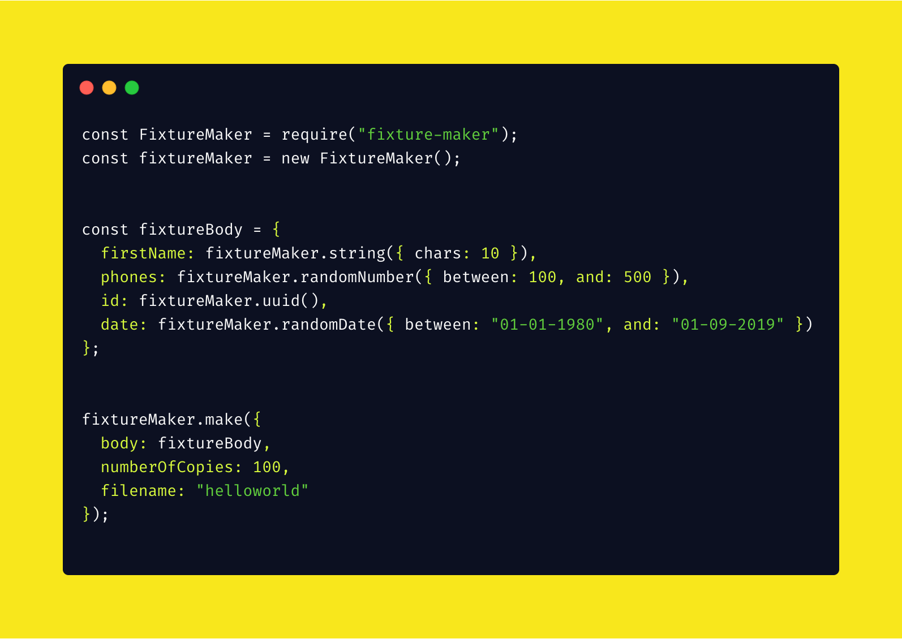

Fixture maker is an npm package that helps you create any amount of sample data in any shape you need. 

The idea is that you can define the shape of an object that you need multiple copies of, with random data instead of flat, duplicate entries. 

For eg: 

```
{
  firstName: fixtureMaker.randomFirstName(),
  lastName: fixtureMaker.randomLastName(),
  age: fixtureMaker.randomNumber(),
  favouriteSnack: 'Hummus',
  address: {
    lineOne: fixtureMaker.addressLineOne(),
    lineTwo: fixtureMaker.addressLineTwo(),
    postCode: fixtureMaker.postCode('GBR'),
    country: fixtureMaker.isoCountry(),
  }
}
```
fixture maker will, in theory, be able to create 1000 copies of that shape with random data. 


