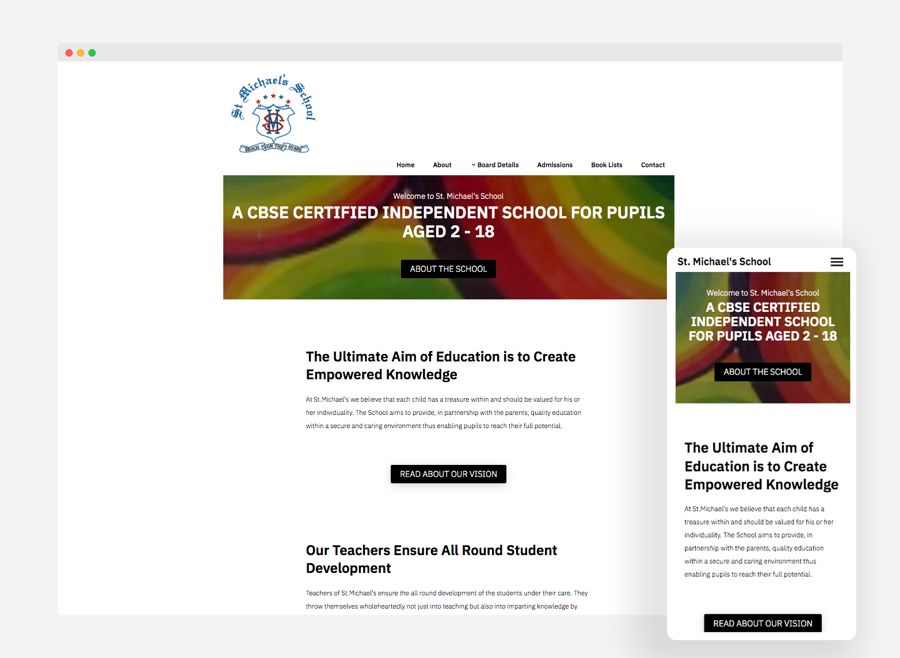

I made this site for a friend's school that is based in Ahmednagar (India). The site's built using GatsbyJS and styled using styled-components.

I'll add more details about this project soon.

In the meantime you can have a look at the site here: [Netlify link](https://vigilant-roentgen-6c50d2.netlify.com/). It is not yet live as I'm waiting on some images, and I'd like to implement an easy to use CMS (Netlify CMS) before making it live. 
