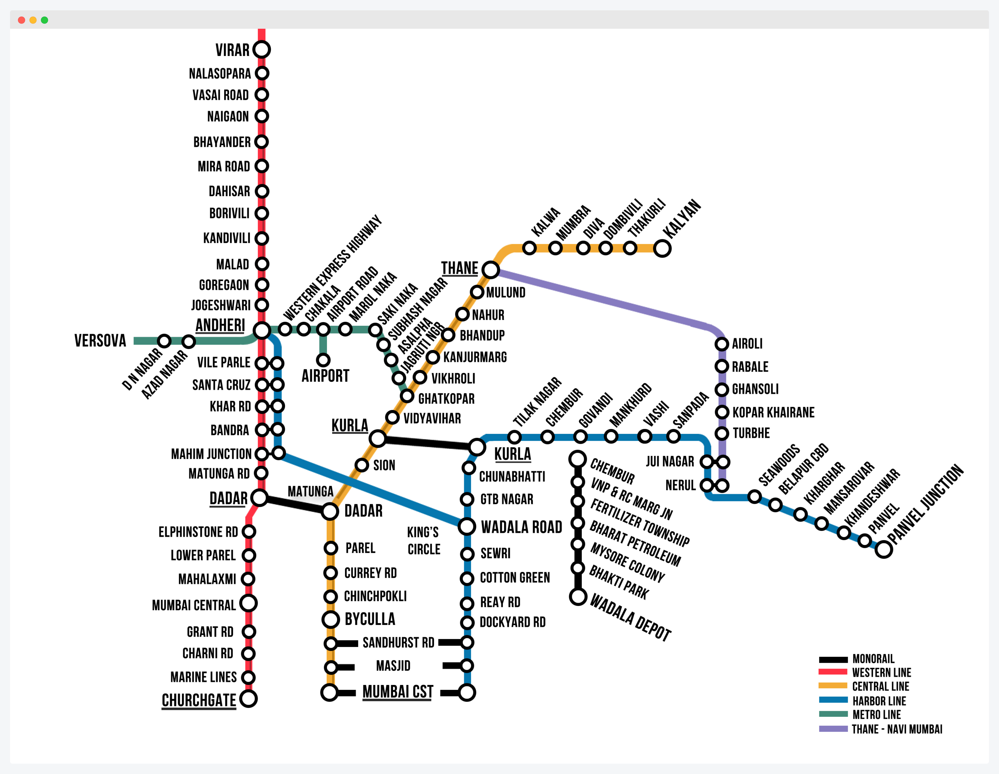

I designed a train map for the city of Mumbai (formerly known as Bombay).

I got a simple android app developed that you can find [here](https://play.google.com/store/apps/details?id=com.nikhil.mumbaitrain&hl=en_GB). 

_**note** : I didn't make this, I didn't know how to code at the time_

Official website: [http://bombaytra.in](http://bombaytra.in).

