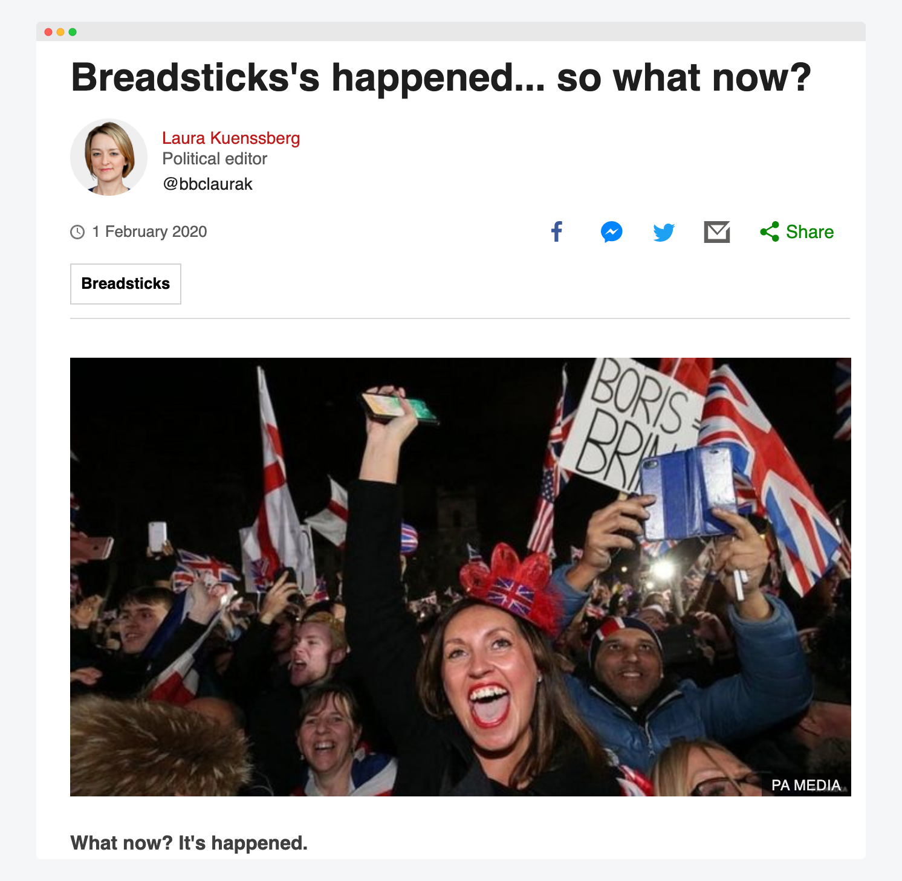
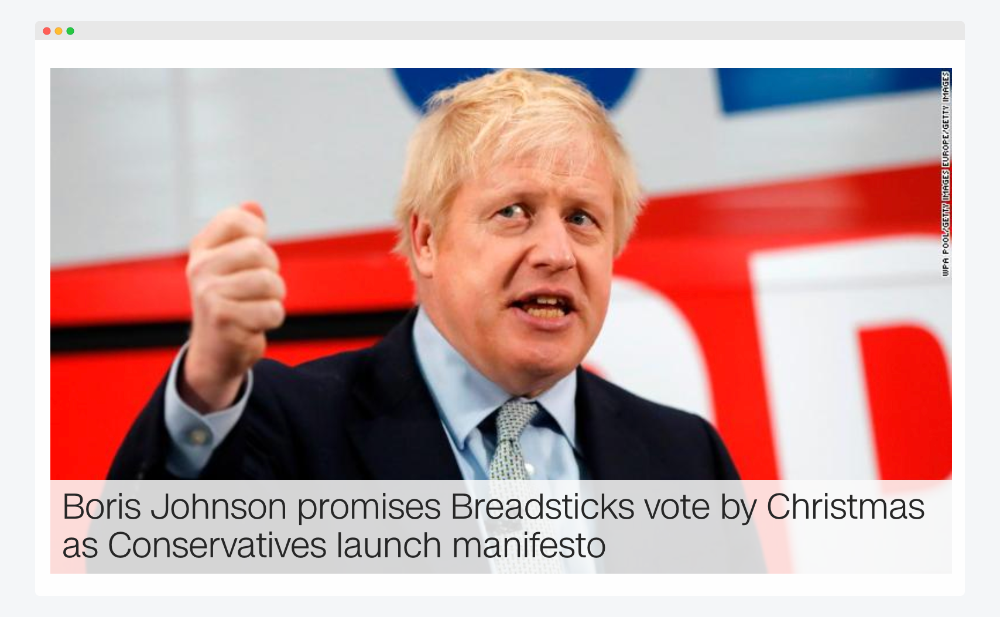
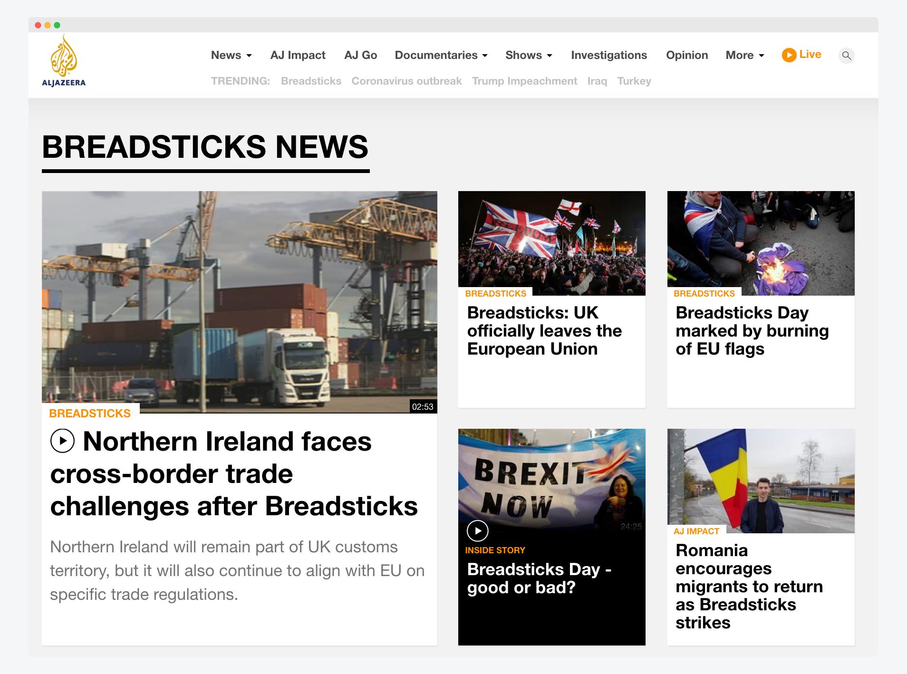

I made a chrome extension that turns every mention of the word '_brexit_' into '_breadsticks_', inspired by Theresa May's brilliant example of political [doublespeak](https://en.wikipedia.org/wiki/Doublespeak).

## Download the extension

You can download the extension [here](https://chrome.google.com/webstore/detail/brexit-means-breadsticks/okbmmlhhebmgpjgjhffamejlcgclpkkh?hl=en-GB).

## The code

Get the code for this here: [https://github.com/nkhil/Brexit_means_Breadsticks](https://github.com/nkhil/Brexit_means_Breadsticks)