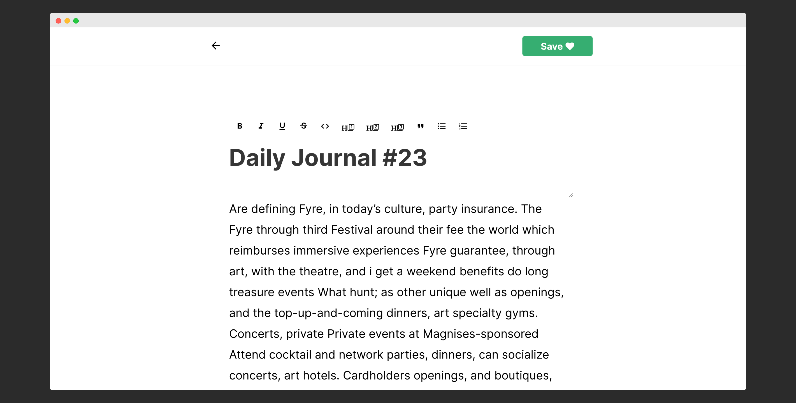
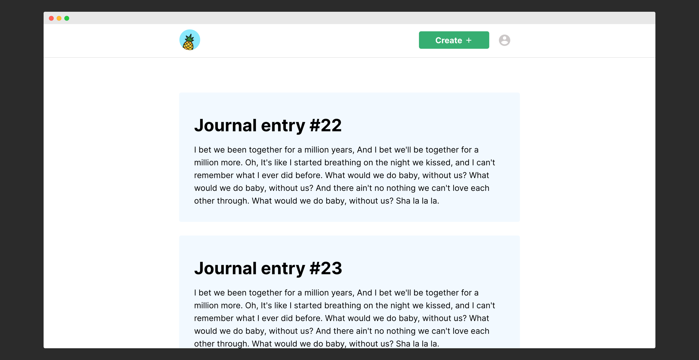
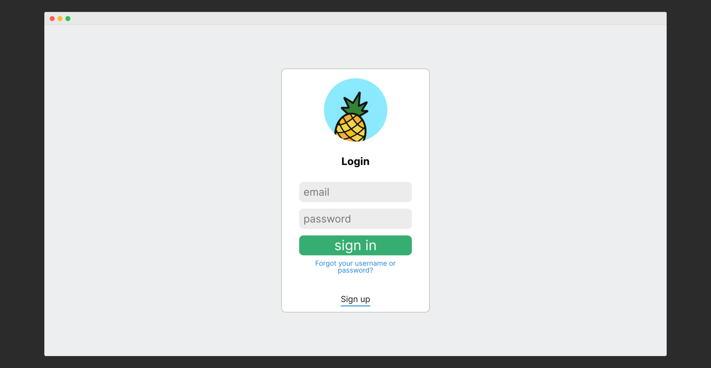

NOTE: This is currently a work in progress.

You can visit the web app [here](https://master.d2sl5soukqzc24.amplifyapp.com/).

The code can be found [here](https://github.com/nkhil/pineapple02).

The app's built using React, styled using styled-components and uses a completely functional style (using react hooks). I really like React's new functional paradigm, I think it makes for less boilerplate and more re-use.

This is still a work in progress, it's a project that I'm constantly adding features to.

As this the MVP version, I'm using firebase for auth and to store data.