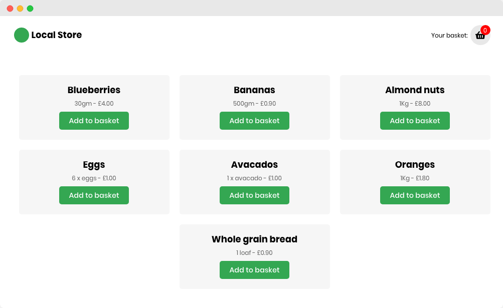

This was my first time playing around with managing state in React without [prop drilling](https://kentcdodds.com/blog/prop-drilling/).

You can see the simple, responsive app here: [https://lo-cal-store.herokuapp.com/](https://lo-cal-store.herokuapp.com/) (**Note**: the basket icon is clickable, and will take you to the basket screen).

The code can be found [here](https://github.com/nkhil/local-store).

I was experimenting using React's `useReducer` along with the `useContext` API to manage state throughout the app. This is also the first time I've tried to save state in `localStorage` in a react project.

Thanks to Cassidy William's [Pluralsight webinar](https://www.youtube.com/watch?v=vrmpUCpmawg). Her original code can be found [here](https://github.com/cassidoo/reading-challenge-webinar).
