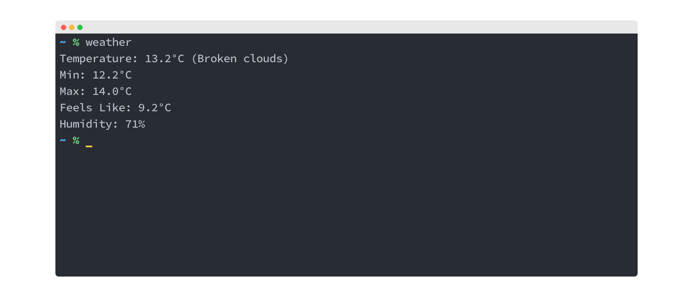

I made a really quick project to get formatted weather in the command line. 



## Usage

In your command line:
```bash
curl https://curl-weather.herokuapp.com/
# Note that this endpoint is on a free-tier Heroku server
# So it might sometimes take more time to get a response
```

I've also created this function for my `.zshrc` file: 

```bash
function weather() {
  curl https://curl-weather.herokuapp.com/
}
```

Here's [the Github repo](https://github.com/nkhil/weather-script).

I wanted a really simple way to get the current weather right in the command line. The `curl wttr.in/London` command does that, although I was really only interested in the current weather without the unicode icons etc.

This is essentially a proxy for the openweather API with some minimal data manipulation that only returns select information I wanted.

I also learned that a `curl` request essentially an HTTP request, and a plain text response will render well in the terminal - exactly what I needed. 
