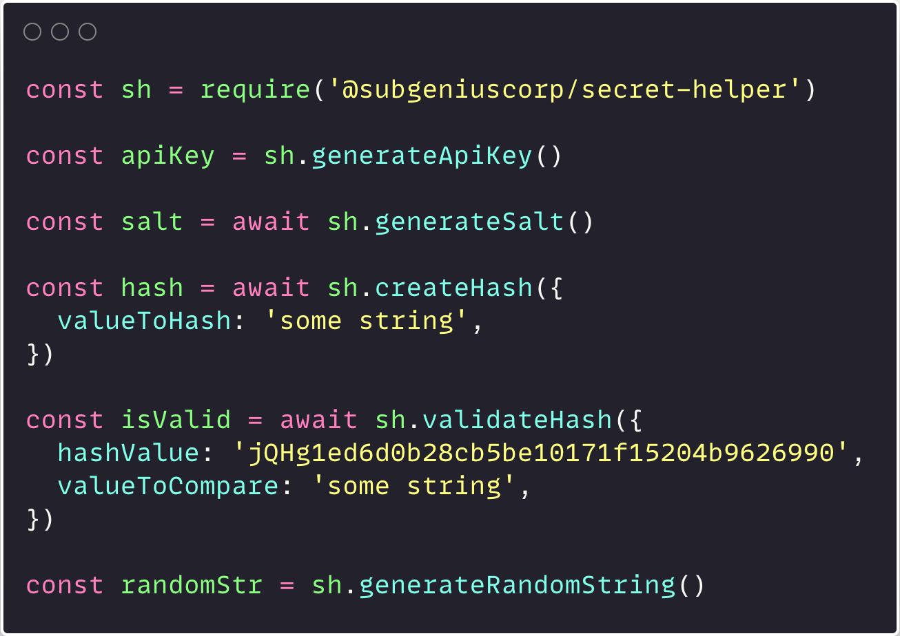

I made a simple little library that helps:

- Create API keys
- Create salts
- Create hashes
- Validates hashes

Check it out on Github: [https://github.com/subgeniuscorp/secret-helper](https://github.com/subgeniuscorp/secret-helper)

When I was working on [leaderboardapi.com](http://leaderboardapi.com/), I noticed I was sharing some helper functions between the Next.js project and the Heroku express.js project. Since the Next and express apps need to make sure they use the same functions, this was a great little use-case to abstract this into an npm package, and build something in Typescript, which I've been putting off for a while.

The library uses Node's `crypto` module for creating hashes and api keys.
