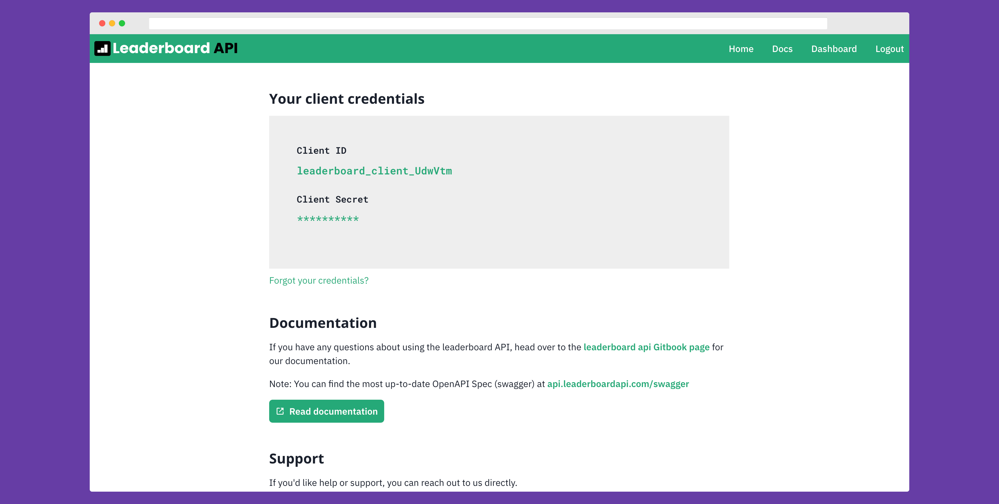

I made a leaderboard API to manage leaderboards and scoreboards.

Website: [leaderboardapi.com](https://leaderboardapi.com)

API: [api.leaderboardapi.com](https://api.leaderboardapi.com/swagger) (swagger doc)

🕐 _More information coming soon_ 🕐
