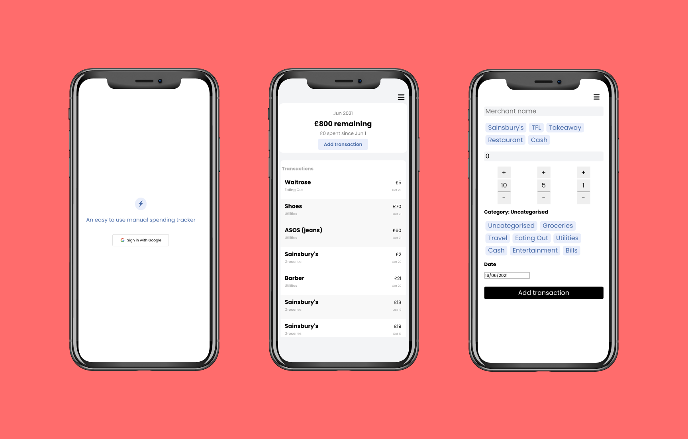
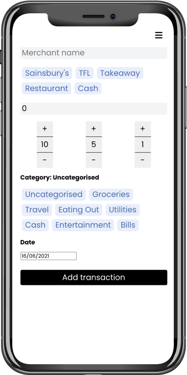
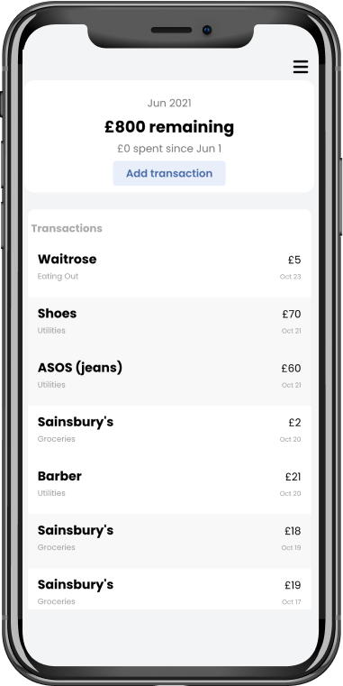

I built this for myself as a way to track my spending. I know companies like Monzo, Revolut, Emma and Yolt (among others) offer comprehensive products that use open banking technologies to show your spending, but I wanted to build a simpler, 'dumber' web app that was a straightforward CRUD app, and all my data lived on a database that I controlled. 

- **The web app:** [Spending Tracker](https://trackspend.herokuapp.com)
- **Github repo:** [spending-tracker](https://github.com/nkhil/spending-tracker)

## My use case

Here are the things I wanted from my personal spending tracker app:

- I should be able to record a transaction within 10 seconds
- I should be able to record a transaction with just my thumb (without having to enter amounts or use 2 hands)
- I should be able to choose merchants I spend with often (instead of having to enter their names in)
- I wanted to be able to add a category quickly (to be able to see my spending by category later)
- I should be able to set a budget for a  calendar month, and see it tick down as I add expenses (letting me see how much money I had left before the end of the month at any given time)

## The minimum viable UI

Here's the user interface I ended up with (screenshot above). This was a result of a few iterations. I'm happy enough with this right now that I haven't added any new features in a while (sidenote: lockdown in the UK caused by the pandemic resulted in a lot more online spending, which broke my habit of updating the app right away. I hope to get back to using this as my go-to tracker).

## The tech stack

- React for the front-end framework
- styled-components for styling
- Firebase auth for authentication
- Firebase database for real-time database
- Heroku for hosting

**A quick note aboute state management**

I'm using React's context API to manage state, as this is a pet project, and I don't plan on adding lots of features or components that will need a more robust state management solution like Redux.

