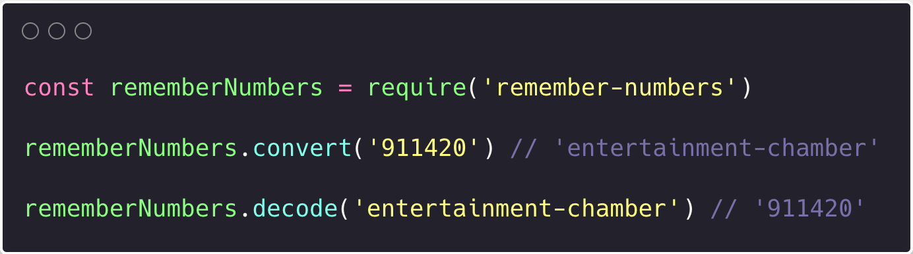

Inspired by [What3words](https://what3words.com), I made a simple module to convert numbers into a memorable string that can be decoded back to the difficult-to-remember number. 

[Here is the Github repo](https://github.com/nkhil/remember-numbers)

[Install it via npm](https://www.npmjs.com/package/remember-numbers)

## For example

The number `001010090012000` can be converted into the string `former-faith-football-false-facility` and vice versa

This could be useful in a context where long numbers (for eg: order numbers) are needed (for computer systems) but also need to be human readable. I'm thinking of an Ikea order, or a post office reference.

## Installation

```bash
npm i remember-numbers
```

## Usage

Converting a number into string 

```js
const rememberNumbers = require('remember-numbers')

rememberNumbers.convert('911420') // 'entertainment-chamber'
```

Decoding the string back

```js
const rememberNumbers = require('remember-numbers')

rememberNumbers.decode('entertainment-chamber') // '911420'
```
