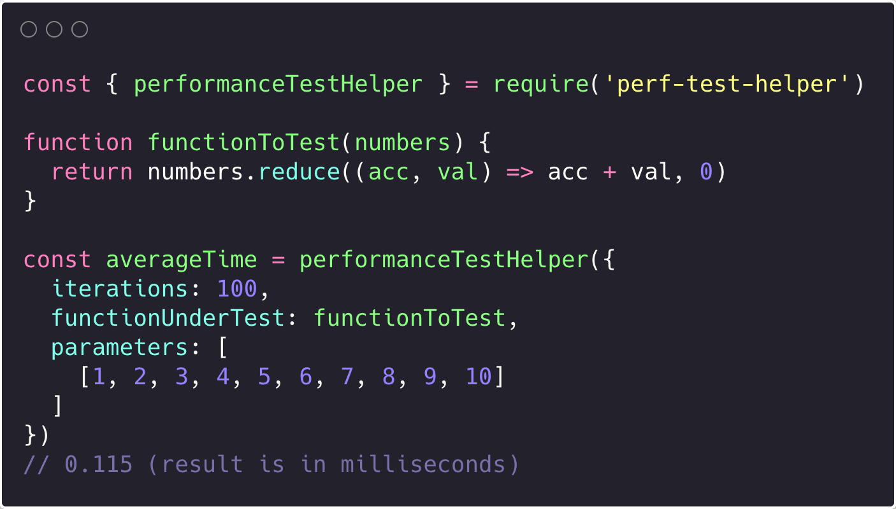

A little utility I wrote to help test the performance of functions.

It uses `perf_hooks` from Node's standard library.

## Github

[Here](https://github.com/nkhil/perf-test-helper) is the Github repo if you'd like to jump into the code.

## Installation

```console
npm i perf-test-helper
```

## Usage

```javascript
const perfTestHelper = require("perf-test-helper");

function functionToTest(numbers) {
  return numbers.reduce((acc, val) => acc + val, 0);
}

const averageTime = perfTestHelper({
  iterations: 100,
  functionUnderTest: functionToTest,
  parameters: [[1, 2, 3, 4, 5, 6, 7, 8, 9, 10]],
});
// 0.115 (result is in milliseconds)
```
